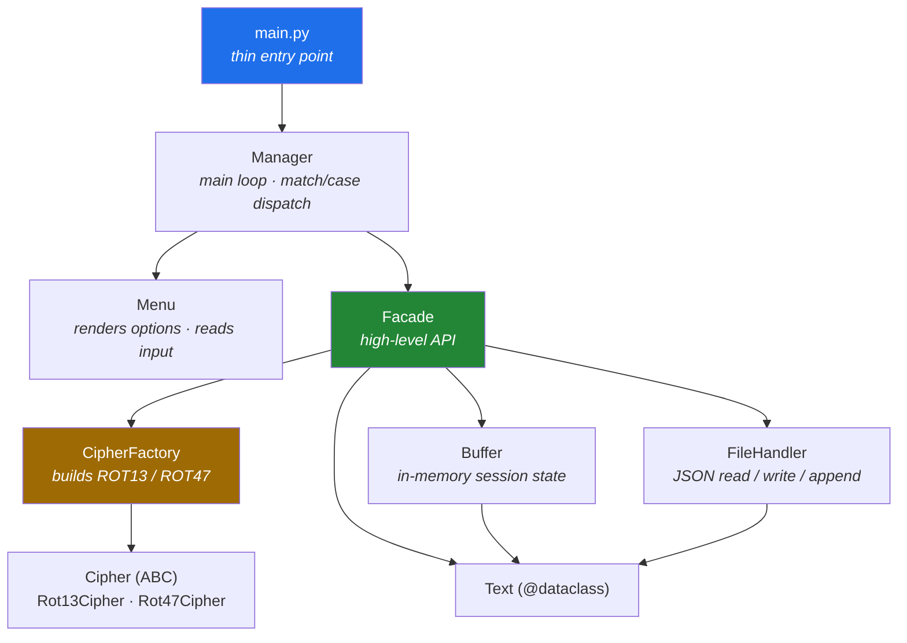

<div align="center">

# 🔐 CIPHER

### A clean-architecture CLI for ROT13 / ROT47 encoding — built as a study in design patterns, typing discipline and engineering hygiene.

<br>

[](https://www.python.org/)
[](https://www.conventionalcommits.org/)

<br>

**🌍 Language / Język:**  **[English](#-english)**  ·  **[Polski](#-polski)**

</div>

---

<a name="-english"></a>

## 🇬🇧 English

### ✨ What is this?

**CIPHER** is a menu-driven command-line application that encrypts and decrypts text using the **ROT13** and **ROT47** substitution ciphers (variants of the classic Caesar cipher). Results live in an in-memory **buffer** during the session and can be persisted to — or loaded back from — **JSON** files.

But the ciphers are not the point. **The point is *how* it's built.** This project is a deliberate exercise in writing Python the way it should be written in a professional team: layered architecture, recognised design patterns, full type coverage, automated quality gates and a clean commit history.

> ⚠️ **A note on honesty:** ROT13 and ROT47 provide **zero** real security — they are reversible by design and trivial to break. This is an *educational* project about software architecture, **not** a cryptography tool. Treating that distinction seriously is itself part of the exercise.

---

### 🎯 Highlights

| | |
|---|---|
| 🧱 **Layered architecture** | Strict one-directional dependency flow — the CLI never touches ciphers or files directly. |
| 🎭 **Design patterns** | **Facade** + **Factory Method / Abstract Factory** applied where they actually earn their keep. |
| 🧰 **No `if/elif` dispatch** | Command routing via Python **structural pattern matching** (`match`/`case`, [PEP 636](https://peps.python.org/pep-0636/)). |
| 🧬 **Typed domain model** | The encoded text is an immutable `@dataclass` with `Enum`-backed fields. |
| 💾 **Robust file I/O** | JSON read/write with **append** semantics and explicit, custom exception handling. |
| 🚧 **Tests — final step** | A unit-test suite for ciphers, factory, buffer, file handler and facade is the project's closing milestone *(planned — not started)*. |
| 🪝 **Quality gates** *(planned)* | `black`, `flake8` and `mypy` via **pre-commit** — a tooling milestone, not yet wired up. |
| 📜 **Clean history** | **GitHub Flow** + **Conventional Commits**, scoped and atomic. |

---

### 🏛️ Architecture

The golden rule: **dependencies point in one direction only.** The user interface knows about the `Facade` and nothing else; the `Facade` orchestrates the subsystems; the subsystems depend only on the domain model. No cycles, ever.



#### Design patterns, and *why*

| Pattern | Where | Why it earns its place |
|---|---|---|
| **Facade** | `Facade` | Gives the CLI a single, simple surface (`encrypt`, `decrypt`, `save`, `load`) and hides the wiring between ciphers, buffer and storage. Swap a subsystem → the CLI doesn't change. |
| **Factory Method / Abstract Factory** | `CipherFactory` | Decouples *"which cipher"* from *"how it's built"*. Adding ROT-anything becomes one new class + one registry entry — **no caller touches a conditional**. |
| **Dataclass (domain model)** | `Text` | The encoded unit (`text`, `rot_type`, `status`) is a typed, self-validating value object — not a loose dict floating through the codebase. |
| **Structural pattern matching** | `Manager` | Menu routing reads as a clean dispatch table instead of an `if/elif` ladder. |

---

### 🗂️ Project structure

```
Cipher/
├── main.py                     # single entry point  →  python main.py
├── README.md
├── pyproject.toml              # ⏳ planned — metadata + black / flake8 / mypy config
├── .pre-commit-config.yaml     # ⏳ planned
├── .gitignore
│
├── cipher/                     # application package
│   ├── facade.py               # 🎭 Facade — high-level API (encrypt/decrypt/save/load)
│   ├── exceptions.py           # custom exceptions (FileHandlerError, …)
│   │
│   ├── models/
│   │   └── text.py             # 🧬 Text dataclass + RotType / Status enums
│   │
│   ├── ciphers/
│   │   ├── base.py             # abstract Cipher (ABC)
│   │   ├── rot13.py            # Rot13Cipher
│   │   ├── rot47.py            # Rot47Cipher
│   │   └── factory.py          # 🏭 CipherFactory
│   │
│   ├── core/
│   │   └── buffer.py           # 📦 Buffer — in-memory session state
│   │
│   ├── storage/
│   │   └── file_handler.py     # 💾 FileHandler — JSON I/O + append
│   │
│   └── cli/
│       ├── menu.py             # 🖥️ Menu — presentation & input
│       └── manager.py          # 🎮 Manager — main loop + match/case dispatch
│
└── tests/                      # ⏳ planned — unit test suite (final milestone)
    └── __init__.py             # only the package placeholder exists today
```

> 💡 The file-storage package is intentionally named `storage`, **not** `io`, to avoid shadowing Python's standard-library `io` module — a small detail that signals attention to the things that bite teams later.

---

### 🚀 Getting started

```bash
# 1 · clone
git clone https://github.com/RobertStachowski/Cipher.git
cd Cipher

# 2 · create & activate a virtual environment
python -m venv .venv
source .venv/bin/activate        # Windows: .venv\Scripts\activate

# 3 · (optional) dev tooling — ⏳ planned, not in the repo yet:
#   pip install -e ".[dev]" && pre-commit install

# 4 · run
python main.py
```

---

### 🕹️ Usage walkthrough

A typical session — encode a word, inspect the buffer, then persist it to disk.

> ℹ️ The CLI speaks **Polish**; the transcript below is the program's real output.

```text
======== CIPHER =========

1 Szyfruj
2 Odszyfruj
3 Zapisz bufor do pliku
4 Wczytaj plik do bufora
5 Pokaż bufor
0 Wyjście
> 1
Podaj tekst: Hello, recruiter!
Wybierz ROT [13 / 47]: 13
✔ Operacja udana: Uryyb, erpehvgre!  encrypted

# (the menu is redrawn on every loop)
> 5

── Bufor (1) ─────────────────
  1. Uryyb, erpehvgre!  rot13  encrypted

> 3
Nazwa pliku: portfolio
✔ Operacja zapisu udana
```

**The flow in words:** pick an action → type your text → pick a ROT → the result is wrapped in a `Text` object and pushed to the **buffer**. Repeat freely. Save → the buffer is written to a JSON file under the name you type (**append** semantics; the buffer is **not** cleared, so you can keep working). Load → file contents flow back into the buffer.

---

### ✅ Testing & quality

```bash
pytest                 # unit tests — ⏳ planned, not configured yet (final milestone)
black .                # format
flake8                 # lint
mypy cipher            # static type check
pre-commit run --all   # everything the commit hook runs
```

> 🚧 The application itself is complete. The **unit-test suite and the tooling above (`black`/`flake8`/`mypy`/`pre-commit`) are the final milestone and aren't set up yet**, so the commands above won't run against the repo as-is.

No automated gates run in the repo yet. Once the tooling milestone lands, every commit will be gated by **pre-commit** (`black` + `flake8`, with `mypy` in CI). For now, the discipline on show lives in the **architecture** and the **commit history**.

---

### 🛠️ Engineering conventions

This repo follows the same disciplines I'd bring to a production codebase:

- **PEP 8** style — the code follows it; automated enforcement by `black` + `flake8` is a planned milestone.
- **Full type hints** on every module. Docstrings on public classes and methods. (`mypy` verification is part of the planned tooling.)
- **GitHub Flow** — short-lived feature branches, reviewed before merge.
- **[Conventional Commits](https://www.conventionalcommits.org/)** with scopes:

  | ✅ Good | ⭐ Best |
  |---|---|
  | `feat: add new way of handling files` | `feat(filehandler): add new way of handling files` |
  | `test: create unit tests for file handling` | `test(filehandler): create unit tests for file handling` |
  | `docs: update readme about file handling` | `docs(readme): update readme about file handling` |

  **Types:** `feat` · `fix` · `build` · `chore` · `ci` · `docs` · `style` · `refactor` · `perf` · `test`

---

### 🧰 Tech stack

**Used —** Python 3.11+ · `dataclasses` · `enum` · `abc` · `json` · structural pattern matching · **zero runtime dependencies (standard library only)**.

**Planned tooling —** pytest · black · flake8 · mypy · pre-commit · GitHub Actions (CI).

---

### 👤 Author

**Robert Stachowski** — built as a portfolio project to demonstrate clean architecture, design patterns and disciplined Python engineering.

<br>

---

<a name="-polski"></a>

## 🇵🇱 Polski

### ✨ Co to jest?

**CIPHER** to sterowana z menu aplikacja CLI, która szyfruje i odszyfrowuje tekst przy użyciu szyfrów podstawieniowych **ROT13** i **ROT47** (warianty klasycznego szyfru Cezara). Wyniki żyją w pamięci w **buforze** podczas sesji i można je zapisać do plików **JSON** lub wczytać z nich z powrotem.

Ale szyfry nie są tu najważniejsze. **Najważniejsze jest *jak* to zostało zbudowane.** Ten projekt to świadome ćwiczenie pisania Pythona tak, jak powinno się go pisać w profesjonalnym zespole: architektura warstwowa, rozpoznawalne wzorce projektowe, pełne typowanie, automatyczne bramki jakości i czysta historia commitów.

> ⚠️ **Słowo uczciwości:** ROT13 i ROT47 nie dają **żadnego** realnego bezpieczeństwa — z założenia są odwracalne i trywialne do złamania. To projekt *edukacyjny* o architekturze oprogramowania, a **nie** narzędzie kryptograficzne. Potraktowanie tego rozróżnienia poważnie samo w sobie jest częścią ćwiczenia.

---

### 🎯 Najważniejsze cechy

| | |
|---|---|
| 🧱 **Architektura warstwowa** | Ścisły, jednokierunkowy przepływ zależności — CLI nigdy nie dotyka bezpośrednio szyfrów ani plików. |
| 🎭 **Wzorce projektowe** | **Facade** + **Factory Method / Abstract Factory**, użyte tam, gdzie naprawdę się opłacają. |
| 🧰 **Bez dispatchu `if/elif`** | Routing komend przez **structural pattern matching** (`match`/`case`, [PEP 636](https://peps.python.org/pep-0636/)). |
| 🧬 **Typowany model domeny** | Zakodowany tekst to niemutowalny `@dataclass` z polami opartymi o `Enum`. |
| 💾 **Solidne I/O plików** | Odczyt/zapis JSON z semantyką **append** i jawną, własną obsługą wyjątków. |
| 🚧 **Testy — ostatni etap** | Zestaw testów jednostkowych szyfrów, fabryki, bufora, file handlera i fasady to domykający kamień milowy projektu *(planowane — nierozpoczęte)*. |
| 🪝 **Bramki jakości** *(planowane)* | `black`, `flake8` i `mypy` przez **pre-commit** — etap tooling, jeszcze nie podpięty. |
| 📜 **Czysta historia** | **GitHub Flow** + **Conventional Commits**, scope'owane i atomowe. |

---

### 🏛️ Architektura

Złota zasada: **zależności wskazują tylko w jedną stronę.** Interfejs użytkownika zna wyłącznie `Facade` i nic więcej; `Facade` dyryguje podsystemami; podsystemy zależą tylko od modelu domeny. Żadnych cykli, nigdy.


#### Wzorce projektowe i *dlaczego*

| Wzorzec | Gdzie | Dlaczego ma sens |
|---|---|---|
| **Facade** | `Facade` | Daje CLI jedną, prostą powierzchnię (`encrypt`, `decrypt`, `save`, `load`) i ukrywa połączenia między szyframi, buforem i pamięcią. Wymiana podsystemu → CLI się nie zmienia. |
| **Factory Method / Abstract Factory** | `CipherFactory` | Odsprzęga *„który szyfr"* od *„jak go zbudować"*. Dodanie kolejnego ROT-a to jedna nowa klasa + wpis w rejestrze — **żaden kod wołający nie dotyka warunku**. |
| **Dataclass (model domeny)** | `Text` | Jednostka zakodowana (`text`, `rot_type`, `status`) to typowany obiekt-wartość, a nie luźny `dict` krążący po kodzie. |
| **Structural pattern matching** | `Manager` | Routing menu czyta się jak czysta tablica dyspozytorska zamiast drabinki `if/elif`. |

---

### 🗂️ Struktura projektu

```
Cipher/
├── main.py                     # jedyny punkt wejścia  →  python main.py
├── README.md
├── pyproject.toml              # ⏳ planowane — metadane + konfiguracja black / flake8 / mypy
├── .pre-commit-config.yaml     # ⏳ planned
├── .gitignore
│
├── cipher/                     # pakiet aplikacji
│   ├── facade.py               # 🎭 Facade — wysokopoziomowe API (encrypt/decrypt/save/load)
│   ├── exceptions.py           # własne wyjątki (FileHandlerError, …)
│   │
│   ├── models/
│   │   └── text.py             # 🧬 dataclass Text + enumy RotType / Status
│   │
│   ├── ciphers/
│   │   ├── base.py             # abstrakcyjny Cipher (ABC)
│   │   ├── rot13.py            # Rot13Cipher
│   │   ├── rot47.py            # Rot47Cipher
│   │   └── factory.py          # 🏭 CipherFactory
│   │
│   ├── core/
│   │   └── buffer.py           # 📦 Buffer — stan sesji w pamięci
│   │
│   ├── storage/
│   │   └── file_handler.py     # 💾 FileHandler — I/O JSON + append
│   │
│   └── cli/
│       ├── menu.py             # 🖥️ Menu — prezentacja i input
│       └── manager.py          # 🎮 Manager — pętla główna + dispatch match/case
│
└── tests/                      # ⏳ planowane — testy jednostkowe (ostatni etap)
    └── __init__.py             # dziś istnieje tylko placeholder pakietu
```

> 💡 Pakiet od plików nazwałem celowo `storage`, a **nie** `io`, żeby nie przykryć standardowego modułu `io` z biblioteki Pythona — drobiazg, który świadczy o uwadze do rzeczy, które potrafią ugryźć zespół później.

---

### 🚀 Jak uruchomić

```bash
# 1 · sklonuj
git clone https://github.com/RobertStachowski/Cipher.git
cd Cipher

# 2 · stwórz i aktywuj wirtualne środowisko
python -m venv .venv
source .venv/bin/activate        # Windows: .venv\Scripts\activate

# 3 · (opcjonalnie) tooling deweloperski — ⏳ planowany, jeszcze nie ma go w repo:
#   pip install -e ".[dev]" && pre-commit install

# 4 · uruchom
python main.py
```

---

### 🕹️ Przykładowa sesja

Typowy przebieg — zakoduj słowo, podejrzyj bufor, a potem zrzuć go na dysk (poniżej realny output programu):

```text
======== CIPHER =========

1 Szyfruj
2 Odszyfruj
3 Zapisz bufor do pliku
4 Wczytaj plik do bufora
5 Pokaż bufor
0 Wyjście
> 1
Podaj tekst: Hello, recruiter!
Wybierz ROT [13 / 47]: 13
✔ Operacja udana: Uryyb, erpehvgre!  encrypted

# (menu jest przerysowywane w każdej iteracji pętli)
> 5

── Bufor (1) ─────────────────
  1. Uryyb, erpehvgre!  rot13  encrypted

> 3
Nazwa pliku: portfolio
✔ Operacja zapisu udana
```

**Przepływ słowami:** wybierz akcję → wpisz tekst → wybierz ROT → wynik zostaje opakowany w obiekt `Text` i dodany do **bufora**. Powtarzaj dowolnie. Zapis → bufor trafia do pliku JSON pod nazwą, którą podasz (semantyka **append**; bufor **nie** jest czyszczony, więc możesz pracować dalej). Wczytanie → zawartość pliku wraca do bufora.

---

### ✅ Testy i jakość

```bash
pytest                 # testy jednostkowe — ⏳ planowane, jeszcze nieskonfigurowane (ostatni etap)
black .                # formatowanie
flake8                 # linting
mypy cipher            # statyczna kontrola typów
pre-commit run --all   # wszystko, co odpala hook commitowy
```

> 🚧 Sama aplikacja jest gotowa. **Zestaw testów oraz tooling powyżej (`black`/`flake8`/`mypy`/`pre-commit`) to ostatni etap i nie są jeszcze skonfigurowane**, więc powyższe komendy nie zadziałają na repo w obecnym stanie.

W repo nie działają jeszcze żadne automatyczne bramki. Gdy domknę etap tooling, każdy commit będzie pilnowany przez **pre-commit** (`black` + `flake8`, z `mypy` w CI). Na razie widoczna dyscyplina siedzi w **architekturze** i **historii commitów**.

---

### 🛠️ Konwencje inżynierskie

To repo trzyma się tych samych dyscyplin, które wniósłbym do kodu produkcyjnego:

- Styl **PEP 8** — kod się go trzyma; automatyczne wymuszanie przez `black` + `flake8` to planowany etap.
- **Pełne typowanie** w każdym module. Docstringi na publicznych klasach i metodach. (Weryfikacja `mypy` to część planowanego toolingu.)
- **GitHub Flow** — krótkożyjące gałęzie feature'owe, recenzowane przed mergem.
- **[Conventional Commits](https://www.conventionalcommits.org/)** ze scope'ami:

  | ✅ Dobrze | ⭐ Najlepiej |
  |---|---|
  | `feat: add new way of handling files` | `feat(filehandler): add new way of handling files` |
  | `test: create unit tests for file handling` | `test(filehandler): create unit tests for file handling` |
  | `docs: update readme about file handling` | `docs(readme): update readme about file handling` |

  **Typy:** `feat` · `fix` · `build` · `chore` · `ci` · `docs` · `style` · `refactor` · `perf` · `test`

---

### 🧰 Stack technologiczny

**Używane —** Python 3.11+ · `dataclasses` · `enum` · `abc` · `json` · structural pattern matching · **zero zależności runtime (tylko biblioteka standardowa)**.

**Planowany tooling —** pytest · black · flake8 · mypy · pre-commit · GitHub Actions (CI).

---

### 👤 Autor

**Robert Stachowski** — projekt portfolio demonstrujący czystą architekturę, wzorce projektowe i zdyscyplinowaną inżynierię w Pythonie.

<div align="center">
<br>

⭐ *If you like clean architecture, leave a star — and good luck reading the rest of the buffer.* ⭐

</div>
