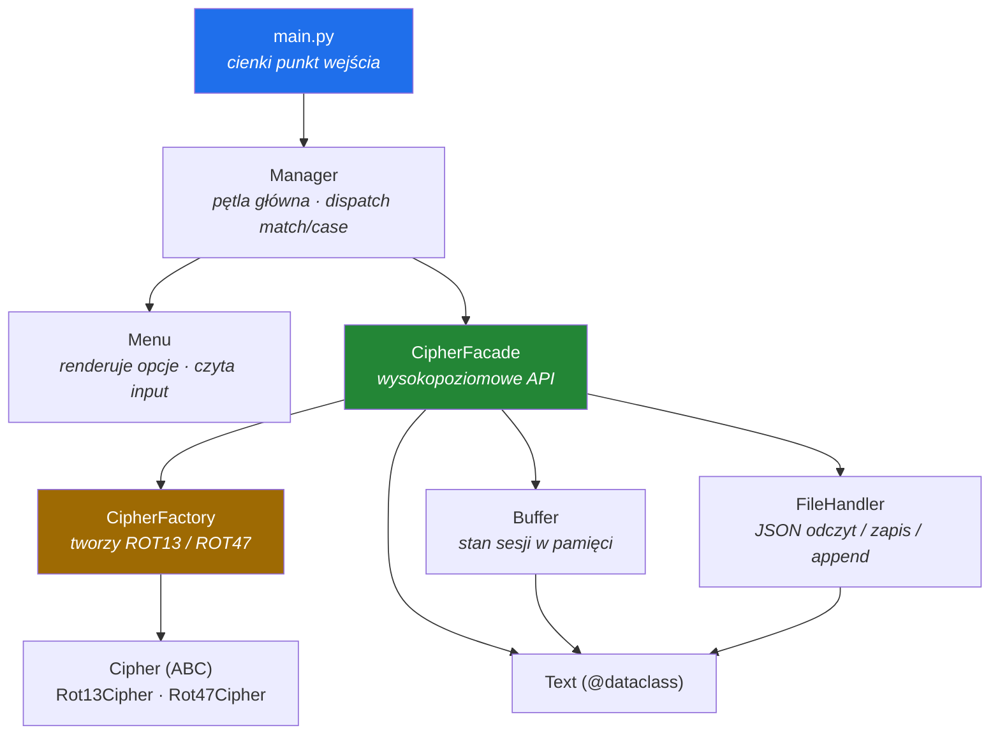

<div align="center">

# 🔐 CIPHER

### A clean-architecture CLI for ROT13 / ROT47 encoding — built as a study in design patterns, typing discipline and engineering hygiene.

<br>

[](https://www.python.org/)
[](https://github.com/psf/black)
[](https://flake8.pycqa.org/)
[](https://mypy-lang.org/)
[](https://pre-commit.com/)
[](https://www.conventionalcommits.org/)
[](https://docs.pytest.org/)

<br>

**🌍 Language / Język:**  **[English](#-english)**  ·  **[Polski](#-polski)**

</div>

---

<a name="-english"></a>

## 🇬🇧 English

### ✨ What is this?

**CIPHER** is a menu-driven command-line application that encrypts and decrypts text using the **ROT13** and **ROT47** substitution ciphers (variants of the classic Caesar cipher). Results live in an in-memory **buffer** during the session and can be persisted to — or loaded back from — **JSON** files.

But the ciphers are not the point. **The point is *how* it's built.** This project is a deliberate exercise in writing Python the way it should be written in a professional team: layered architecture, recognised design patterns, full type coverage, automated quality gates and a clean commit history.

> ⚠️ **A note on honesty:** ROT13 and ROT47 provide **zero** real security — they are reversible by design and trivial to break. This is an *educational* project about software architecture, **not** a cryptography tool. Treating that distinction seriously is itself part of the exercise.

---

### 🎯 Highlights

| | |
|---|---|
| 🧱 **Layered architecture** | Strict one-directional dependency flow — the CLI never touches ciphers or files directly. |
| 🎭 **Design patterns** | **Facade** + **Factory Method / Abstract Factory** applied where they actually earn their keep. |
| 🧰 **No `if/elif` dispatch** | Command routing via Python **structural pattern matching** (`match`/`case`, [PEP 636](https://peps.python.org/pep-0636/)). |
| 🧬 **Typed domain model** | The encoded text is an immutable `@dataclass` with `Enum`-backed fields. |
| 💾 **Robust file I/O** | JSON read/write with **append** semantics and explicit, custom exception handling. |
| ✅ **Tested** | Unit tests for ciphers, factory, buffer, file handler and the facade. |
| 🪝 **Automated quality gates** | `black`, `flake8` and `mypy` run on every commit via **pre-commit**. |
| 📜 **Clean history** | **GitHub Flow** + **Conventional Commits**, scoped and atomic. |

---

### 🏛️ Architecture

The golden rule: **dependencies point in one direction only.** The user interface knows about the `Facade` and nothing else; the `Facade` orchestrates the subsystems; the subsystems depend only on the domain model. No cycles, ever.


#### Design patterns, and *why*

| Pattern | Where | Why it earns its place |
|---|---|---|
| **Facade** | `CipherFacade` | Gives the CLI a single, simple surface (`encrypt`, `decrypt`, `save`, `load`) and hides the wiring between ciphers, buffer and storage. Swap a subsystem → the CLI doesn't change. |
| **Factory Method / Abstract Factory** | `CipherFactory` | Decouples *"which cipher"* from *"how it's built"*. Adding ROT-anything becomes one new class + one registry entry — **no caller touches a conditional**. |
| **Dataclass (domain model)** | `Text` | The encoded unit (`text`, `rot_type`, `status`) is a typed, self-validating value object — not a loose dict floating through the codebase. |
| **Structural pattern matching** | `Manager` | Menu routing reads as a clean dispatch table instead of an `if/elif` ladder. |

---

### 🗂️ Project structure

```
Cipher/
├── main.py                     # single entry point  →  python main.py
├── README.md
├── pyproject.toml              # project metadata + black / flake8 / mypy config
├── .pre-commit-config.yaml
├── .gitignore
│
├── cipher/                     # application package
│   ├── facade.py               # 🎭 Facade — high-level API (encrypt/decrypt/save/load)
│   ├── exceptions.py           # custom exceptions (FileHandlerError, …)
│   │
│   ├── models/
│   │   └── text.py             # 🧬 Text dataclass + RotType / Status enums
│   │
│   ├── ciphers/
│   │   ├── base.py             # abstract Cipher (ABC)
│   │   ├── rot13.py            # Rot13Cipher
│   │   ├── rot47.py            # Rot47Cipher
│   │   └── factory.py          # 🏭 CipherFactory
│   │
│   ├── core/
│   │   └── buffer.py           # 📦 Buffer — in-memory session state
│   │
│   ├── storage/
│   │   └── file_handler.py     # 💾 FileHandler — JSON I/O + append
│   │
│   └── cli/
│       ├── menu.py             # 🖥️ Menu — presentation & input
│       └── manager.py          # 🎮 Manager — main loop + match/case dispatch
│
└── tests/                      # ✅ unit tests
    ├── test_ciphers.py
    ├── test_factory.py
    ├── test_buffer.py
    ├── test_file_handler.py
    └── test_facade.py
```

> 💡 The file-storage package is intentionally named `storage`, **not** `io`, to avoid shadowing Python's standard-library `io` module — a small detail that signals attention to the things that bite teams later.

---

### 🚀 Getting started

```bash
# 1 · clone
git clone https://github.com/RobertStachowski/Cipher.git
cd Cipher

# 2 · create & activate a virtual environment
python -m venv .venv
source .venv/bin/activate        # Windows: .venv\Scripts\activate

# 3 · install dev tooling
pip install -r requirements-dev.txt   # or: pip install -e ".[dev]"
pre-commit install

# 4 · run
python main.py
```

---

### 🕹️ Usage walkthrough

A typical session — encode a couple of words, then flush the buffer to disk:

```text
╔══════════════════════════════╗
║           CIPHER             ║
╠══════════════════════════════╣
║  1 · Encrypt                 ║
║  2 · Decrypt                 ║
║  3 · Save buffer to file     ║
║  4 · Load file into buffer   ║
║  5 · Show buffer             ║
║  0 · Exit                    ║
╚══════════════════════════════╝
> 1

Choose ROT [13 / 47]: 13
Enter text: Hello, recruiter!
✔ Encoded → "Uryyb, erpehvgre!"  (stored in buffer)

> 3
File name: portfolio
✔ 1 entry written to portfolio.json   (buffer kept intact)
```

**The flow in words:** pick an action → pick a ROT → type your text → the result is wrapped in a `Text` object and pushed to the **buffer**. Repeat freely. Save → the buffer is serialized to JSON (and **not** cleared, so you can keep working). Load → file contents flow back into the buffer.

---

### ✅ Testing & quality

```bash
pytest                 # run the unit test suite
black .                # format
flake8                 # lint
mypy cipher            # static type check
pre-commit run --all   # everything the commit hook runs
```

Every commit is gated by **pre-commit** running `black` + `flake8` (and `mypy` in CI), so the `main` branch stays green and consistently formatted.

---

### 🛠️ Engineering conventions

This repo follows the same disciplines I'd bring to a production codebase:

- **PEP 8** style, enforced — not just suggested — by `black` + `flake8`.
- **Full type hints**, checked with **mypy**. Docstrings on public classes and methods.
- **GitHub Flow** — short-lived feature branches, reviewed before merge.
- **[Conventional Commits](https://www.conventionalcommits.org/)** with scopes:

  | ✅ Good | ⭐ Best |
  |---|---|
  | `feat: add new way of handling files` | `feat(filehandler): add new way of handling files` |
  | `test: create unit tests for file handling` | `test(filehandler): create unit tests for file handling` |
  | `docs: update readme about file handling` | `docs(readme): update readme about file handling` |

  **Types:** `feat` · `fix` · `build` · `chore` · `ci` · `docs` · `style` · `refactor` · `perf` · `test`

---

### 🧰 Tech stack

**Python 3.11+** · `dataclasses` · `enum` · `abc` · `json` · structural pattern matching · **pytest** · **black** · **flake8** · **mypy** · **pre-commit** · GitHub Actions *(optional CI)*

---

### 👤 Author

**Robert Stachowski** — built as a portfolio project to demonstrate clean architecture, design patterns and disciplined Python engineering.

<br>

---

<a name="-polski"></a>

## 🇵🇱 Polski

### ✨ Co to jest?

**CIPHER** to sterowana z menu aplikacja CLI, która szyfruje i odszyfrowuje tekst przy użyciu szyfrów podstawieniowych **ROT13** i **ROT47** (warianty klasycznego szyfru Cezara). Wyniki żyją w pamięci w **buforze** podczas sesji i można je zapisać do plików **JSON** lub wczytać z nich z powrotem.

Ale szyfry nie są tu najważniejsze. **Najważniejsze jest *jak* to zostało zbudowane.** Ten projekt to świadome ćwiczenie pisania Pythona tak, jak powinno się go pisać w profesjonalnym zespole: architektura warstwowa, rozpoznawalne wzorce projektowe, pełne typowanie, automatyczne bramki jakości i czysta historia commitów.

> ⚠️ **Słowo uczciwości:** ROT13 i ROT47 nie dają **żadnego** realnego bezpieczeństwa — z założenia są odwracalne i trywialne do złamania. To projekt *edukacyjny* o architekturze oprogramowania, a **nie** narzędzie kryptograficzne. Potraktowanie tego rozróżnienia poważnie samo w sobie jest częścią ćwiczenia.

---

### 🎯 Najważniejsze cechy

| | |
|---|---|
| 🧱 **Architektura warstwowa** | Ścisły, jednokierunkowy przepływ zależności — CLI nigdy nie dotyka bezpośrednio szyfrów ani plików. |
| 🎭 **Wzorce projektowe** | **Facade** + **Factory Method / Abstract Factory**, użyte tam, gdzie naprawdę się opłacają. |
| 🧰 **Bez dispatchu `if/elif`** | Routing komend przez **structural pattern matching** (`match`/`case`, [PEP 636](https://peps.python.org/pep-0636/)). |
| 🧬 **Typowany model domeny** | Zakodowany tekst to niemutowalny `@dataclass` z polami opartymi o `Enum`. |
| 💾 **Solidne I/O plików** | Odczyt/zapis JSON z semantyką **append** i jawną, własną obsługą wyjątków. |
| ✅ **Przetestowane** | Testy jednostkowe szyfrów, fabryki, bufora, file handlera i fasady. |
| 🪝 **Automatyczne bramki jakości** | `black`, `flake8` i `mypy` uruchamiane przy każdym commicie przez **pre-commit**. |
| 📜 **Czysta historia** | **GitHub Flow** + **Conventional Commits**, scope'owane i atomowe. |

---

### 🏛️ Architektura

Złota zasada: **zależności wskazują tylko w jedną stronę.** Interfejs użytkownika zna wyłącznie `Facade` i nic więcej; `Facade` dyryguje podsystemami; podsystemy zależą tylko od modelu domeny. Żadnych cykli, nigdy.



#### Wzorce projektowe i *dlaczego*

| Wzorzec | Gdzie | Dlaczego ma sens |
|---|---|---|
| **Facade** | `CipherFacade` | Daje CLI jedną, prostą powierzchnię (`encrypt`, `decrypt`, `save`, `load`) i ukrywa połączenia między szyframi, buforem i pamięcią. Wymiana podsystemu → CLI się nie zmienia. |
| **Factory Method / Abstract Factory** | `CipherFactory` | Odsprzęga *„który szyfr"* od *„jak go zbudować"*. Dodanie kolejnego ROT-a to jedna nowa klasa + wpis w rejestrze — **żaden kod wołający nie dotyka warunku**. |
| **Dataclass (model domeny)** | `Text` | Jednostka zakodowana (`text`, `rot_type`, `status`) to typowany obiekt-wartość, a nie luźny `dict` krążący po kodzie. |
| **Structural pattern matching** | `Manager` | Routing menu czyta się jak czysta tablica dyspozytorska zamiast drabinki `if/elif`. |

---

### 🗂️ Struktura projektu

```
Cipher/
├── main.py                     # jedyny punkt wejścia  →  python main.py
├── README.md
├── pyproject.toml              # metadane + konfiguracja black / flake8 / mypy
├── .pre-commit-config.yaml
├── .gitignore
│
├── cipher/                     # pakiet aplikacji
│   ├── facade.py               # 🎭 Facade — wysokopoziomowe API (encrypt/decrypt/save/load)
│   ├── exceptions.py           # własne wyjątki (FileHandlerError, …)
│   │
│   ├── models/
│   │   └── text.py             # 🧬 dataclass Text + enumy RotType / Status
│   │
│   ├── ciphers/
│   │   ├── base.py             # abstrakcyjny Cipher (ABC)
│   │   ├── rot13.py            # Rot13Cipher
│   │   ├── rot47.py            # Rot47Cipher
│   │   └── factory.py          # 🏭 CipherFactory
│   │
│   ├── core/
│   │   └── buffer.py           # 📦 Buffer — stan sesji w pamięci
│   │
│   ├── storage/
│   │   └── file_handler.py     # 💾 FileHandler — I/O JSON + append
│   │
│   └── cli/
│       ├── menu.py             # 🖥️ Menu — prezentacja i input
│       └── manager.py          # 🎮 Manager — pętla główna + dispatch match/case
│
└── tests/                      # ✅ testy jednostkowe
    ├── test_ciphers.py
    ├── test_factory.py
    ├── test_buffer.py
    ├── test_file_handler.py
    └── test_facade.py
```

> 💡 Pakiet od plików nazwałem celowo `storage`, a **nie** `io`, żeby nie przykryć standardowego modułu `io` z biblioteki Pythona — drobiazg, który świadczy o uwadze do rzeczy, które potrafią ugryźć zespół później.

---

### 🚀 Jak uruchomić

```bash
# 1 · sklonuj
git clone https://github.com/RobertStachowski/Cipher.git
cd Cipher

# 2 · stwórz i aktywuj wirtualne środowisko
python -m venv .venv
source .venv/bin/activate        # Windows: .venv\Scripts\activate

# 3 · zainstaluj narzędzia deweloperskie
pip install -r requirements-dev.txt   # lub: pip install -e ".[dev]"
pre-commit install

# 4 · uruchom
python main.py
```

---

### 🕹️ Przykładowa sesja

Typowy przebieg — zakoduj kilka słów, a potem zrzuć bufor na dysk:

```text
╔══════════════════════════════╗
║           CIPHER             ║
╠══════════════════════════════╣
║  1 · Szyfruj                 ║
║  2 · Odszyfruj               ║
║  3 · Zapisz bufor do pliku   ║
║  4 · Wczytaj plik do bufora  ║
║  5 · Pokaż bufor             ║
║  0 · Wyjście                 ║
╚══════════════════════════════╝
> 1

Wybierz ROT [13 / 47]: 13
Podaj tekst: Hello, recruiter!
✔ Zakodowano → "Uryyb, erpehvgre!"  (zapisano w buforze)

> 3
Nazwa pliku: portfolio
✔ Zapisano 1 wpis do portfolio.json   (bufor nietknięty)
```

**Przepływ słowami:** wybierz akcję → wybierz ROT → wpisz tekst → wynik zostaje opakowany w obiekt `Text` i dodany do **bufora**. Powtarzaj dowolnie. Zapis → bufor jest serializowany do JSON (i **nie** czyszczony, więc możesz pracować dalej). Wczytanie → zawartość pliku wraca do bufora.

---

### ✅ Testy i jakość

```bash
pytest                 # uruchom testy jednostkowe
black .                # formatowanie
flake8                 # linting
mypy cipher            # statyczna kontrola typów
pre-commit run --all   # wszystko, co odpala hook commitowy
```

Każdy commit jest pilnowany przez **pre-commit** uruchamiający `black` + `flake8` (oraz `mypy` w CI), dzięki czemu gałąź `main` zostaje zielona i spójnie sformatowana.

---

### 🛠️ Konwencje inżynierskie

To repo trzyma się tych samych dyscyplin, które wniósłbym do kodu produkcyjnego:

- Styl **PEP 8**, wymuszany — nie tylko sugerowany — przez `black` + `flake8`.
- **Pełne typowanie**, sprawdzane przez **mypy**. Docstringi na publicznych klasach i metodach.
- **GitHub Flow** — krótkożyjące gałęzie feature'owe, recenzowane przed mergem.
- **[Conventional Commits](https://www.conventionalcommits.org/)** ze scope'ami:

  | ✅ Dobrze | ⭐ Najlepiej |
  |---|---|
  | `feat: add new way of handling files` | `feat(filehandler): add new way of handling files` |
  | `test: create unit tests for file handling` | `test(filehandler): create unit tests for file handling` |
  | `docs: update readme about file handling` | `docs(readme): update readme about file handling` |

  **Typy:** `feat` · `fix` · `build` · `chore` · `ci` · `docs` · `style` · `refactor` · `perf` · `test`

---

### 🧰 Stack technologiczny

**Python 3.11+** · `dataclasses` · `enum` · `abc` · `json` · structural pattern matching · **pytest** · **black** · **flake8** · **mypy** · **pre-commit** · GitHub Actions *(opcjonalne CI)*

---

### 👤 Autor

**Robert Stachowski** — projekt portfolio demonstrujący czystą architekturę, wzorce projektowe i zdyscyplinowaną inżynierię w Pythonie.

<div align="center">
<br>

⭐ *If you like clean architecture, leave a star — and good luck reading the rest of the buffer.* ⭐

</div>
