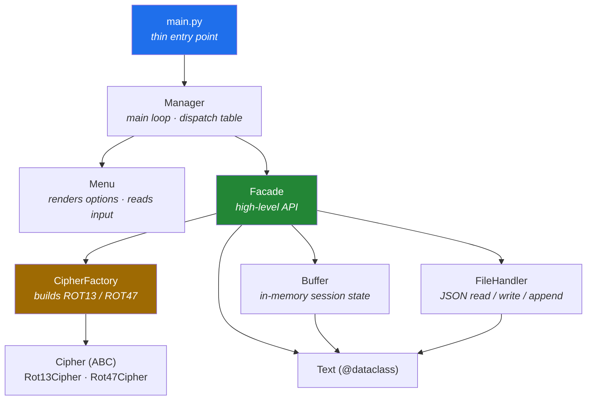
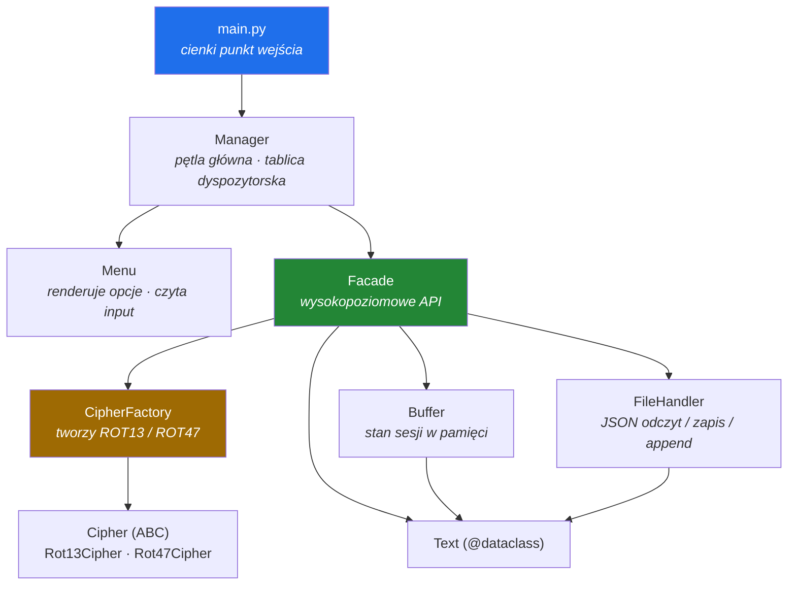

<div align="center">

# 🔐 CIPHER

### A clean-architecture CLI for ROT13 / ROT47 encoding — built as a study in design patterns, typing discipline and engineering hygiene.

<br>

[](https://www.python.org/)
[](https://docs.astral.sh/ruff/)
[](https://pre-commit.com/)
[](https://docs.pytest.org/)
[](https://www.conventionalcommits.org/)

<br>

**🌍 Language / Język:**  **[English](#-english)**  ·  **[Polski](#-polski)**

</div>

---

<a name="-english"></a>

## 🇬🇧 English

### ✨ What is this?

**CIPHER** is a menu-driven command-line application that encrypts and decrypts text using the **ROT13** and **ROT47** substitution ciphers (variants of the classic Caesar cipher). Results live in an in-memory **buffer** during the session and can be persisted to — or loaded back from — **JSON** files.

But the ciphers are not the point. **The point is *how* it's built.** This project is a deliberate exercise in writing Python the way it should be written in a professional team: layered architecture, recognised design patterns, full type coverage, automated quality gates and a clean commit history.

> ⚠️ **A note on honesty:** ROT13 and ROT47 provide **zero** real security — they are reversible by design and trivial to break. This is an *educational* project about software architecture, **not** a cryptography tool. Treating that distinction seriously is itself part of the exercise.

---

### 🎯 Highlights

| | |
|---|---|
| 🧱 **Layered architecture** | Strict one-directional dependency flow — the CLI never touches ciphers or files directly. |
| 🎭 **Design patterns** | **Facade** + **Factory Method / Abstract Factory** applied where they actually earn their keep. |
| 🧰 **No `if/elif` dispatch** | Command routing via a **dispatch table** — adding a menu option is one dictionary entry, not another branch. |
| 🧬 **Typed domain model** | The encoded text is an immutable `@dataclass` with `Enum`-backed fields. |
| 💾 **Robust file I/O** | JSON read/write with **append** semantics and explicit, custom exception handling. |
| 🧪 **Tested** | **54 unit tests** covering ciphers, factory, buffer, domain model, file handler and facade — with `tmp_path` isolation and `create_autospec` mocks. |
| 🪝 **Quality gates on every commit** | **Ruff** (lint + format), **isort**, **Bandit** (security) and commit-message validation, all wired through **pre-commit**. |
| 📜 **Clean history** | **GitHub Flow** + **Conventional Commits**, scoped and atomic — machine-enforced, not just promised. |

---

### 🏛️ Architecture

The golden rule: **dependencies point in one direction only.** The user interface knows about the `Facade` and nothing else; the `Facade` orchestrates the subsystems; the subsystems depend only on the domain model. No cycles, ever.


```mermaid
flowchart TD
    A["main.py<br/><i>thin entry point</i>"] --> B["Manager<br/><i>main loop · dispatch table</i>"]
    B --> M["Menu<br/><i>renders options · reads input</i>"]
    B --> F["Facade<br/><i>high-level API</i>"]
    F --> C["CipherFactory<br/><i>builds ROT13 / ROT47</i>"]
    F --> BUF["Buffer<br/><i>in-memory session state</i>"]
    F --> S["FileHandler<br/><i>JSON read / write / append</i>"]
    C --> CIP["Cipher (ABC)<br/>Rot13Cipher · Rot47Cipher"]
    F --> T["Text (@dataclass)"]
    BUF --> T
    S --> T

    style A fill:#1f6feb,color:#fff
    style F fill:#238636,color:#fff
    style C fill:#9e6a03,color:#fff
```

That single rule is what makes the test suite cheap to write: because `Facade` receives its `Buffer` and `FileHandler` through the constructor, a test can hand it an autospec double and assert on the interaction — no monkey-patching, no global state, no touching the disk.

#### Design patterns, and *why*

| Pattern | Where | Why it earns its place |
|---|---|---|
| **Facade** | `Facade` | Gives the CLI a single, simple surface (`encrypt`, `decrypt`, `save`, `load`) and hides the wiring between ciphers, buffer and storage. Swap a subsystem → the CLI doesn't change. |
| **Factory Method / Abstract Factory** | `CipherFactory` | Decouples *"which cipher"* from *"how it's built"*. Adding ROT-anything becomes one new class + one registry entry — **no caller touches a conditional**. |
| **Dataclass (domain model)** | `Text` | The encoded unit (`text`, `rot_type`, `status`) is a frozen, typed value object — not a loose dict floating through the codebase. |
| **Dependency injection** | `Manager`, `Facade` | Collaborators arrive through the constructor, never built inside. That is precisely what makes the CLI and the facade testable without a terminal or a filesystem. |
| **Dispatch table** | `Manager` | Menu routing reads as a `dict` of handlers instead of an `if/elif` ladder — adding an option is one entry, not one more branch. |

---

### 🗂️ Project structure

```
Cipher/
├── main.py                     # single entry point  →  python main.py
├── README.md
├── pyproject.toml              # tool configuration (Bandit)
├── .pre-commit-config.yaml     # 🪝 quality gates
├── .gitignore
│
├── cipher/                     # application package — zero runtime dependencies
│   ├── facade.py               # 🎭 Facade — high-level API (encrypt/decrypt/save/load)
│   ├── exceptions.py           # custom exceptions (FileHandlerError, …)
│   │
│   ├── models/
│   │   └── text.py             # 🧬 frozen Text dataclass + RotType / Status enums
│   │
│   ├── ciphers/
│   │   ├── base.py             # abstract Cipher (ABC)
│   │   ├── rot13.py            # Rot13Cipher
│   │   ├── rot47.py            # Rot47Cipher
│   │   └── factory.py          # 🏭 CipherFactory
│   │
│   ├── core/
│   │   └── buffer.py           # 📦 Buffer — in-memory session state
│   │
│   ├── storage/
│   │   └── file_handler.py     # 💾 FileHandler — JSON I/O + append
│   │
│   └── cli/
│       ├── menu.py             # 🖥️ Menu — presentation & input
│       └── manager.py          # 🎮 Manager — main loop + dispatch table
│
└── tests/                      # 🧪 pytest suite — mirrors the package layout
    ├── test_facade.py          # 8 tests · create_autospec doubles
    ├── ciphers/
    │   ├── test_rot13.py       # 12 tests · parametrised edge cases
    │   ├── test_rot47.py       #  8 tests
    │   └── test_factory.py     #  4 tests
    ├── core/test_buffer.py     #  3 tests · guards the defensive copy
    ├── models/test_text.py     #  2 tests · immutability contract
    ├── storage/
    │   └── test_file_handler.py #  14 tests · tmp_path isolation
    └── cli/test_manager.py     #  3 tests · fake Menu / Facade  ⏳ in progress
```

> 💡 The file-storage package is intentionally named `storage`, **not** `io`, to avoid shadowing Python's standard-library `io` module — a small detail that signals attention to the things that bite teams later.

---

### 🚀 Getting started

```bash
# 1 · clone
git clone https://github.com/Robert-Stachowski/cipher.git
cd cipher

# 2 · create & activate a virtual environment
python -m venv .venv
source .venv/bin/activate        # Windows: .venv\Scripts\activate

# 3 · run — no dependencies required, the app is pure standard library
python main.py
```

#### Contributing / dev setup

```bash
pip install pytest pytest-mock pre-commit

pre-commit install                          # lint + format gate
pre-commit install --hook-type commit-msg   # Conventional Commits gate
```

---

### 🕹️ Usage walkthrough

A typical session — encode a word, inspect the buffer, then persist it to disk.

> ℹ️ The CLI speaks **Polish**; the transcript below is the program's real output.

```text
======== CIPHER =========

1 Szyfruj
2 Odszyfruj
3 Zapisz bufor do pliku
4 Wczytaj plik do bufora
5 Pokaż bufor
0 Wyjście
> 1
Podaj tekst: Hello, recruiter!
Wybierz ROT [13 / 47]: 13
✔ Operacja udana: Uryyb, erpehvgre!  encrypted

# (the menu is redrawn on every loop)
> 5

── Bufor (1) ─────────────────
  1. Uryyb, erpehvgre!  rot13  encrypted

> 3
Nazwa pliku: portfolio
✔ Operacja zapisu udana
```

**The flow in words:** pick an action → type your text → pick a ROT → the result is wrapped in a `Text` object and pushed to the **buffer**. Repeat freely. Save → the buffer is written to a JSON file under the name you type (**append** semantics; the buffer is **not** cleared, so you can keep working). Load → file contents flow back into the buffer.

---

### ✅ Testing & quality

```bash
pytest -q                  # 54 unit tests
ruff check .               # lint
ruff format .              # format
pre-commit run --all-files # everything the commit hooks run
```

#### How the tests are written

The suite is small on purpose — every test earns its place by pinning down a decision that could plausibly regress:

- **`create_autospec(FileHandler, instance=True)`** for the facade — a double built from the *real* signature, so renaming a method or changing its arity breaks the test instead of silently passing. A hand-written fake was deliberately [replaced with one](https://github.com/Robert-Stachowski/cipher/commit/1912bcc37431187749d269e09bcda99265bec784) for exactly this reason.
- **`tmp_path`** for every filesystem test — real files, real `json` round-trips, zero pollution outside the temp directory.
- **`pytest.mark.parametrize`** for cipher edge cases: wrap-around at `z`/`Z`, non-letters left untouched, empty input, full ROT47 printable range.
- **Injected fakes** for the CLI, so `Manager`'s routing is verified without ever touching `stdin`.
- **Error paths are first-class:** saving onto a directory, malformed JSON, a JSON object where a list was expected, and unknown enum values each have their own test asserting `FileHandlerError`.

#### The quality gates

Every commit passes through **pre-commit** before it lands:

| Hook | What it guards |
|---|---|
| **`ruff-check`** | Linting — unused imports and variables, undefined names, real bugs. |
| **`ruff-format`** | Formatting — one canonical style, so diffs are about logic, never whitespace. |
| **`isort`** (black profile) | Import ordering: stdlib → third-party → local. |
| **`bandit`** | Security scan — `eval`, hardcoded secrets, unsafe `subprocess` calls. Configured in `pyproject.toml` to skip the test suite. |
| **`conventional-pre-commit`** | Rejects a commit message that isn't a valid Conventional Commit. |
| **pre-commit-hooks** | Trailing whitespace, missing final newline, broken YAML/TOML/JSON, oversized files, unresolved merge conflicts, forgotten `breakpoint()`, and pytest test-file naming. |

#### 🛠️ Why Ruff instead of `flake8` + `black`

The original plan called for `flake8`. It was replaced by [**Ruff**](https://docs.astral.sh/ruff/) after a closer look — and the reasoning is worth stating, because tool choices are engineering decisions like any other:

- **One tool instead of five.** `flake8` is *only* a linter, and a thin one; a realistic setup pulls in `pycodestyle`, `pyflakes`, `flake8-bugbear`, `pyupgrade`, plus `black` for formatting and `isort` for imports. Ruff reimplements **800+ rules** from that ecosystem *and* ships a black-compatible formatter — one dependency, one config block, one mental model.
- **Speed you can feel.** Written in Rust, it lints this repository in single-digit milliseconds. That matters more than it sounds: a gate fast enough to run on every save is a gate that actually gets run.
- **It's where the ecosystem went.** Ruff is now the default choice in a large share of modern Python projects — knowing it is closer to current practice than knowing `flake8`.

The honest trade-off: `flake8`'s plugin ecosystem still has niche checks Ruff hasn't ported, and Ruff moves fast enough that its rule set is a moving target. For a project this size, neither outweighs collapsing five tools into one.

---

### 🛠️ Engineering conventions

This repo follows the same disciplines I'd bring to a production codebase:

- **PEP 8 style**, enforced automatically by `ruff format` and `ruff check` — not by good intentions.
- **Full type hints** on every module, including `ClassVar` annotations on class-level registries. Docstrings on public classes and methods.
- **GitHub Flow** — short-lived feature branches, reviewed before merge.
- **Atomic commits** — a formatting sweep and a behaviour change never share a commit, so `git log` stays reviewable.
- **[Conventional Commits](https://www.conventionalcommits.org/)** with scopes, validated by a `commit-msg` hook:

  | ✅ Good | ⭐ Best |
  |---|---|
  | `feat: add new way of handling files` | `feat(filehandler): add new way of handling files` |
  | `test: create unit tests for file handling` | `test(filehandler): create unit tests for file handling` |
  | `docs: update readme about file handling` | `docs(readme): update readme about file handling` |

  **Types:** `feat` · `fix` · `build` · `chore` · `ci` · `docs` · `style` · `refactor` · `perf` · `test`

---

### 🧰 Tech stack

**Runtime —** Python 3.11+ · `dataclasses` · `enum` (`StrEnum`) · `abc` · `json` · `typing` (`ClassVar`, `Callable`) · **zero runtime dependencies (standard library only)**.

**Development —** pytest · pytest-mock · Ruff · isort · Bandit · pre-commit.

---

### 🗺️ Roadmap

| | Status |
|---|---|
| Application — architecture, patterns, CLI | ✅ Done |
| Unit tests — ciphers, factory, buffer, model, storage, facade | ✅ Done · 54 tests |
| Quality gates — Ruff, isort, Bandit, pre-commit, commit-msg validation | ✅ Done |
| Unit tests — `Manager` and `Menu` (CLI layer) | ⏳ In progress |
| `mypy` static type checking | 📋 Planned |
| GitHub Actions CI | 📋 Planned |

---

### 👤 Author

**Robert Stachowski** — built as a portfolio project to demonstrate clean architecture, design patterns and disciplined Python engineering.

<br>

---

<a name="-polski"></a>

## 🇵🇱 Polski

### ✨ Co to jest?

**CIPHER** to sterowana z menu aplikacja CLI, która szyfruje i odszyfrowuje tekst przy użyciu szyfrów podstawieniowych **ROT13** i **ROT47** (warianty klasycznego szyfru Cezara). Wyniki żyją w pamięci w **buforze** podczas sesji i można je zapisać do plików **JSON** lub wczytać z nich z powrotem.

Ale szyfry nie są tu najważniejsze. **Najważniejsze jest *jak* to zostało zbudowane.** Ten projekt to świadome ćwiczenie pisania Pythona tak, jak powinno się go pisać w profesjonalnym zespole: architektura warstwowa, rozpoznawalne wzorce projektowe, pełne typowanie, automatyczne bramki jakości i czysta historia commitów.

> ⚠️ **Słowo uczciwości:** ROT13 i ROT47 nie dają **żadnego** realnego bezpieczeństwa — z założenia są odwracalne i trywialne do złamania. To projekt *edukacyjny* o architekturze oprogramowania, a **nie** narzędzie kryptograficzne. Potraktowanie tego rozróżnienia poważnie samo w sobie jest częścią ćwiczenia.

---

### 🎯 Najważniejsze cechy

| | |
|---|---|
| 🧱 **Architektura warstwowa** | Ścisły, jednokierunkowy przepływ zależności — CLI nigdy nie dotyka bezpośrednio szyfrów ani plików. |
| 🎭 **Wzorce projektowe** | **Facade** + **Factory Method / Abstract Factory**, użyte tam, gdzie naprawdę się opłacają. |
| 🧰 **Bez dispatchu `if/elif`** | Routing komend przez **tablicę dyspozytorską** — dodanie opcji w menu to jeden wpis w słowniku, a nie kolejne rozgałęzienie. |
| 🧬 **Typowany model domeny** | Zakodowany tekst to niemutowalny `@dataclass` z polami opartymi o `Enum`. |
| 💾 **Solidne I/O plików** | Odczyt/zapis JSON z semantyką **append** i jawną, własną obsługą wyjątków. |
| 🧪 **Otestowane** | **54 testy jednostkowe** szyfrów, fabryki, bufora, modelu domeny, file handlera i fasady — z izolacją przez `tmp_path` i mockami `create_autospec`. |
| 🪝 **Bramki jakości na każdym commicie** | **Ruff** (lint + format), **isort**, **Bandit** (bezpieczeństwo) i walidacja treści commita — wszystko spięte przez **pre-commit**. |
| 📜 **Czysta historia** | **GitHub Flow** + **Conventional Commits**, scope'owane i atomowe — wymuszane maszynowo, nie deklaratywnie. |

---

### 🏛️ Architektura

Złota zasada: **zależności wskazują tylko w jedną stronę.** Interfejs użytkownika zna wyłącznie `Facade` i nic więcej; `Facade` dyryguje podsystemami; podsystemy zależą tylko od modelu domeny. Żadnych cykli, nigdy.


```mermaid
flowchart TD
    A["main.py<br/><i>cienki punkt wejścia</i>"] --> B["Manager<br/><i>pętla główna · tablica dyspozytorska</i>"]
    B --> M["Menu<br/><i>renderuje opcje · czyta input</i>"]
    B --> F["Facade<br/><i>wysokopoziomowe API</i>"]
    F --> C["CipherFactory<br/><i>tworzy ROT13 / ROT47</i>"]
    F --> BUF["Buffer<br/><i>stan sesji w pamięci</i>"]
    F --> S["FileHandler<br/><i>JSON odczyt / zapis / append</i>"]
    C --> CIP["Cipher (ABC)<br/>Rot13Cipher · Rot47Cipher"]
    F --> T["Text (@dataclass)"]
    BUF --> T
    S --> T

    style A fill:#1f6feb,color:#fff
    style F fill:#238636,color:#fff
    style C fill:#9e6a03,color:#fff
```

Ta jedna zasada sprawia, że testy pisze się tanio: skoro `Facade` dostaje `Buffer` i `FileHandler` przez konstruktor, test może podstawić mu autospec-owego sobowtóra i sprawdzić interakcję — bez monkey-patchingu, bez globalnego stanu, bez dotykania dysku.

#### Wzorce projektowe i *dlaczego*

| Wzorzec | Gdzie | Dlaczego ma sens |
|---|---|---|
| **Facade** | `Facade` | Daje CLI jedną, prostą powierzchnię (`encrypt`, `decrypt`, `save`, `load`) i ukrywa połączenia między szyframi, buforem i pamięcią. Wymiana podsystemu → CLI się nie zmienia. |
| **Factory Method / Abstract Factory** | `CipherFactory` | Odsprzęga *„który szyfr"* od *„jak go zbudować"*. Dodanie kolejnego ROT-a to jedna nowa klasa + wpis w rejestrze — **żaden kod wołający nie dotyka warunku**. |
| **Dataclass (model domeny)** | `Text` | Jednostka zakodowana (`text`, `rot_type`, `status`) to zamrożony, typowany obiekt-wartość, a nie luźny `dict` krążący po kodzie. |
| **Wstrzykiwanie zależności** | `Manager`, `Facade` | Współpracownicy przychodzą przez konstruktor, nigdy nie są tworzeni w środku. To właśnie dzięki temu CLI i fasadę da się testować bez terminala i bez systemu plików. |
| **Tablica dyspozytorska** | `Manager` | Routing menu czyta się jak `dict` handlerów zamiast drabinki `if/elif` — dodanie opcji to jeden wpis, a nie kolejne rozgałęzienie. |

---

### 🗂️ Struktura projektu

```
Cipher/
├── main.py                     # jedyny punkt wejścia  →  python main.py
├── README.md
├── pyproject.toml              # konfiguracja narzędzi (Bandit)
├── .pre-commit-config.yaml     # 🪝 bramki jakości
├── .gitignore
│
├── cipher/                     # pakiet aplikacji — zero zależności runtime
│   ├── facade.py               # 🎭 Facade — wysokopoziomowe API (encrypt/decrypt/save/load)
│   ├── exceptions.py           # własne wyjątki (FileHandlerError, …)
│   │
│   ├── models/
│   │   └── text.py             # 🧬 zamrożony dataclass Text + enumy RotType / Status
│   │
│   ├── ciphers/
│   │   ├── base.py             # abstrakcyjny Cipher (ABC)
│   │   ├── rot13.py            # Rot13Cipher
│   │   ├── rot47.py            # Rot47Cipher
│   │   └── factory.py          # 🏭 CipherFactory
│   │
│   ├── core/
│   │   └── buffer.py           # 📦 Buffer — stan sesji w pamięci
│   │
│   ├── storage/
│   │   └── file_handler.py     # 💾 FileHandler — I/O JSON + append
│   │
│   └── cli/
│       ├── menu.py             # 🖥️ Menu — prezentacja i input
│       └── manager.py          # 🎮 Manager — pętla główna + tablica dyspozytorska
│
└── tests/                      # 🧪 zestaw pytest — odbija strukturę pakietu
    ├── test_facade.py          # 8 testów · sobowtóry create_autospec
    ├── ciphers/
    │   ├── test_rot13.py       # 12 testów · sparametryzowane przypadki brzegowe
    │   ├── test_rot47.py       #  8 testów
    │   └── test_factory.py     #  4 testy
    ├── core/test_buffer.py     #  3 testy · pilnują kopii obronnej
    ├── models/test_text.py     #  2 testy · kontrakt niemutowalności
    ├── storage/
    │   └── test_file_handler.py #  14 testów · izolacja przez tmp_path
    └── cli/test_manager.py     #  3 testy · atrapy Menu / Facade  ⏳ w toku
```

> 💡 Pakiet od plików nazwałem celowo `storage`, a **nie** `io`, żeby nie przykryć standardowego modułu `io` z biblioteki Pythona — drobiazg, który świadczy o uwadze do rzeczy, które potrafią ugryźć zespół później.

---

### 🚀 Jak uruchomić

```bash
# 1 · sklonuj
git clone https://github.com/Robert-Stachowski/cipher.git
cd cipher

# 2 · stwórz i aktywuj wirtualne środowisko
python -m venv .venv
source .venv/bin/activate        # Windows: .venv\Scripts\activate

# 3 · uruchom — nie trzeba nic instalować, aplikacja to czysty stdlib
python main.py
```

#### Środowisko deweloperskie

```bash
pip install pytest pytest-mock pre-commit

pre-commit install                          # bramka lint + format
pre-commit install --hook-type commit-msg   # bramka Conventional Commits
```

---

### 🕹️ Przykładowa sesja

Typowy przebieg — zakoduj słowo, podejrzyj bufor, a potem zrzuć go na dysk (poniżej realny output programu):

```text
======== CIPHER =========

1 Szyfruj
2 Odszyfruj
3 Zapisz bufor do pliku
4 Wczytaj plik do bufora
5 Pokaż bufor
0 Wyjście
> 1
Podaj tekst: Hello, recruiter!
Wybierz ROT [13 / 47]: 13
✔ Operacja udana: Uryyb, erpehvgre!  encrypted

# (menu jest przerysowywane w każdej iteracji pętli)
> 5

── Bufor (1) ─────────────────
  1. Uryyb, erpehvgre!  rot13  encrypted

> 3
Nazwa pliku: portfolio
✔ Operacja zapisu udana
```

**Przepływ słowami:** wybierz akcję → wpisz tekst → wybierz ROT → wynik zostaje opakowany w obiekt `Text` i dodany do **bufora**. Powtarzaj dowolnie. Zapis → bufor trafia do pliku JSON pod nazwą, którą podasz (semantyka **append**; bufor **nie** jest czyszczony, więc możesz pracować dalej). Wczytanie → zawartość pliku wraca do bufora.

---

### ✅ Testy i jakość

```bash
pytest -q                  # 54 testy jednostkowe
ruff check .               # linting
ruff format .              # formatowanie
pre-commit run --all-files # wszystko, co odpalają hooki commitowe
```

#### Jak są napisane testy

Zestaw jest celowo niewielki — każdy test zarabia na swoje miejsce, przybijając decyzję, która realnie mogłaby się zepsuć:

- **`create_autospec(FileHandler, instance=True)`** dla fasady — sobowtór zbudowany z *prawdziwej* sygnatury, więc zmiana nazwy metody albo liczby argumentów wywala test, zamiast przejść po cichu. Ręcznie pisana atrapa została [świadomie nim zastąpiona](https://github.com/Robert-Stachowski/cipher/commit/1912bcc37431187749d269e09bcda99265bec784) właśnie z tego powodu.
- **`tmp_path`** w każdym teście plikowym — prawdziwe pliki, prawdziwy round-trip `json`, zero śmiecenia poza katalogiem tymczasowym.
- **`pytest.mark.parametrize`** na przypadkach brzegowych szyfrów: zawijanie na `z`/`Z`, nie-litery zostawione bez zmian, pusty input, pełny zakres drukowalny ROT47.
- **Wstrzyknięte atrapy** w CLI, dzięki czemu routing `Managera` jest weryfikowany bez dotykania `stdin`.
- **Ścieżki błędów są pełnoprawnym obywatelem:** zapis na katalog, uszkodzony JSON, obiekt JSON tam, gdzie oczekiwana jest lista, i nieznana wartość enuma — każdy ma własny test sprawdzający `FileHandlerError`.

#### Bramki jakości

Każdy commit przechodzi przez **pre-commit**, zanim wyląduje w historii:

| Hook | Czego pilnuje |
|---|---|
| **`ruff-check`** | Linting — nieużywane importy i zmienne, niezdefiniowane nazwy, realne błędy. |
| **`ruff-format`** | Formatowanie — jeden kanoniczny styl, więc diffy są o logice, nigdy o białych znakach. |
| **`isort`** (profil black) | Kolejność importów: stdlib → third-party → lokalne. |
| **`bandit`** | Skan bezpieczeństwa — `eval`, zaszyte sekrety, niebezpieczne wywołania `subprocess`. Skonfigurowany w `pyproject.toml` tak, by pomijał testy. |
| **`conventional-pre-commit`** | Odrzuca commit, którego treść nie jest poprawnym Conventional Commitem. |
| pre-commit-hooks | Białe znaki na końcu linii, brak newline'a na końcu pliku, zepsute YAML/TOML/JSON, za duże pliki, nierozwiązane konflikty merge'a, zapomniany `breakpoint()` i nazewnictwo plików testowych. |

#### 🛠️ Dlaczego Ruff zamiast `flake8` + `black`

W pierwotnym planie był `flake8`. Po bliższym przyjrzeniu się zastąpił go [**Ruff**](https://docs.astral.sh/ruff/) — i warto tę decyzję nazwać, bo wybór narzędzi to decyzja inżynierska jak każda inna:

- **Jedno narzędzie zamiast pięciu.** `flake8` jest *tylko* linterem, i to cienkim; realistyczny zestaw dokłada do niego `pycodestyle`, `pyflakes`, `flake8-bugbear`, `pyupgrade`, plus `black` do formatowania i `isort` do importów. Ruff reimplementuje **800+ reguł** z tego ekosystemu *i* ma własny, kompatybilny z blackiem formatter — jedna zależność, jeden blok konfiguracji, jeden model myślowy.
- **Szybkość, którą się czuje.** Napisany w Ruście, lintuje to repozytorium w jednocyfrowej liczbie milisekund. To znaczy więcej, niż brzmi: bramka na tyle szybka, żeby odpalać ją przy każdym zapisie, to bramka, którą się realnie odpala.
- **Tam poszedł ekosystem.** Ruff jest dziś domyślnym wyborem w dużej części nowoczesnych projektów pythonowych — jego znajomość jest bliżej aktualnej praktyki niż znajomość `flake8`.

Uczciwy trade-off: ekosystem pluginów `flake8` wciąż ma niszowe kontrole, których Ruff nie przeportował, a sam Ruff rozwija się na tyle szybko, że jego zestaw reguł jest ruchomym celem. W projekcie tej wielkości żadne z tego nie przeważa nad zwinięciem pięciu narzędzi w jedno.

---

### 🛠️ Konwencje inżynierskie

To repo trzyma się tych samych dyscyplin, które wniósłbym do kodu produkcyjnego:

- **Styl PEP 8**, wymuszany automatycznie przez `ruff format` i `ruff check` — a nie przez dobre chęci.
- **Pełne typowanie** w każdym module, łącznie z adnotacjami `ClassVar` na rejestrach klasowych. Docstringi na publicznych klasach i metodach.
- **GitHub Flow** — krótkożyjące gałęzie feature'owe, recenzowane przed mergem.
- **Atomowe commity** — przelot formatujący i zmiana zachowania nigdy nie dzielą jednego commita, dzięki czemu `git log` da się czytać.
- **[Conventional Commits](https://www.conventionalcommits.org/)** ze scope'ami, walidowane hookiem `commit-msg`:

  | ✅ Dobrze | ⭐ Najlepiej |
  |---|---|
  | `feat: add new way of handling files` | `feat(filehandler): add new way of handling files` |
  | `test: create unit tests for file handling` | `test(filehandler): create unit tests for file handling` |
  | `docs: update readme about file handling` | `docs(readme): update readme about file handling` |

  **Typy:** `feat` · `fix` · `build` · `chore` · `ci` · `docs` · `style` · `refactor` · `perf` · `test`

---

### 🧰 Stack technologiczny

**Runtime —** Python 3.11+ · `dataclasses` · `enum` (`StrEnum`) · `abc` · `json` · `typing` (`ClassVar`, `Callable`) · **zero zależności runtime (tylko biblioteka standardowa)**.

**Deweloperskie —** pytest · pytest-mock · Ruff · isort · Bandit · pre-commit.

---

### 🗺️ Plan rozwoju

| | Status |
|---|---|
| Aplikacja — architektura, wzorce, CLI | ✅ Gotowe |
| Testy jednostkowe — szyfry, fabryka, bufor, model, storage, fasada | ✅ Gotowe · 54 testy |
| Bramki jakości — Ruff, isort, Bandit, pre-commit, walidacja commit-msg | ✅ Gotowe |
| Testy jednostkowe — `Manager` i `Menu` (warstwa CLI) | ⏳ W toku |
| Statyczna kontrola typów `mypy` | 📋 Planowane |
| CI na GitHub Actions | 📋 Planowane |

---

### 👤 Autor

**Robert Stachowski** — projekt portfolio demonstrujący czystą architekturę, wzorce projektowe i zdyscyplinowaną inżynierię w Pythonie.

<div align="center">
<br>

⭐ *If you like clean architecture, leave a star — and good luck reading the rest of the buffer.* ⭐

</div>
