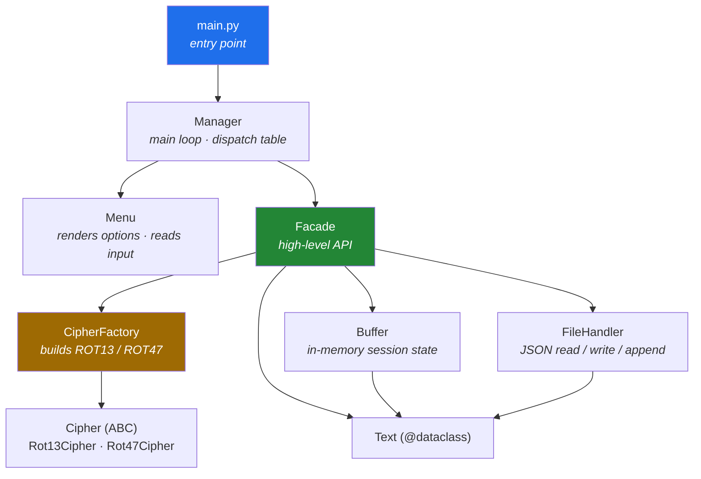

# Cipher

[](https://www.python.org/)
[](https://docs.astral.sh/ruff/)
[](https://pre-commit.com/)
[](https://docs.pytest.org/)
[](https://www.conventionalcommits.org/)

Wersja polska: [README_PL.md](README_PL.md)

A menu-driven CLI that encodes and decodes text with ROT13 and ROT47. Results stay
in an in-memory buffer for the length of a session and can be written to, or read
back from, JSON files.

I built it to practise the parts of Python that carry over between projects: a
layered package, design patterns in the places that needed them, typed signatures,
tests on every layer and automated checks before each commit. The ciphers
themselves are the smallest part of the code.

One warning: ROT13 and ROT47 give no security at all. Both are reversible by
design and breakable by hand, so nothing here is meant to protect anything.

## What it does

- Encodes and decodes text with ROT13 or ROT47, chosen from a numbered menu.
- Keeps every result in a session buffer and lists it on request.
- Appends the buffer to a JSON file, and loads a file back into the buffer.
- Reports a missing file, an unreadable file or malformed JSON through one
  exception type and returns to the menu.

## Architecture

Dependencies point in one direction. The user interface knows `Facade` and nothing
else, `Facade` orchestrates the subsystems, and the subsystems depend only on the
domain model.


```mermaid
flowchart TD
    A["main.py<br/><i>entry point</i>"] --> B["Manager<br/><i>main loop · dispatch table</i>"]
    B --> M["Menu<br/><i>renders options · reads input</i>"]
    B --> F["Facade<br/><i>high-level API</i>"]
    F --> C["CipherFactory<br/><i>builds ROT13 / ROT47</i>"]
    F --> BUF["Buffer<br/><i>in-memory session state</i>"]
    F --> S["FileHandler<br/><i>JSON read / write / append</i>"]
    C --> CIP["Cipher (ABC)<br/>Rot13Cipher · Rot47Cipher"]
    F --> T["Text (@dataclass)"]
    BUF --> T
    S --> T

    style A fill:#1f6feb,color:#fff
    style F fill:#238636,color:#fff
    style C fill:#9e6a03,color:#fff
```

`Facade` receives its `Buffer` and `FileHandler` through the constructor, which is
what lets a test hand it autospec doubles and assert on the interaction instead of
on the disk.

| Pattern | Where | What it buys |
|---|---|---|
| Facade | `Facade` | One surface for the CLI: `encrypt`, `decrypt`, `save`, `load`. Replacing a subsystem leaves the CLI untouched. |
| Factory Method | `CipherFactory` | Adding another ROT means one new class and one registry entry, and no caller grows a conditional. |
| Frozen dataclass | `Text` | `text`, `rot_type` and `status` travel together as one typed value rather than a loose dict. |
| Dependency injection | `Manager`, `Facade` | Collaborators arrive through the constructor, so both can be tested without a terminal or a filesystem. |
| Dispatch table | `Manager` | The main loop looks a handler up in a dict. `Menu` renders the list of options, so a new command is registered in both places. |

The storage package is named `storage` rather than `io`, so that it does not shadow
the standard-library module of that name.

## Getting started

```bash
git clone https://github.com/Robert-Stachowski/cipher.git
cd cipher

python -m venv .venv
source .venv/bin/activate        # Windows: .venv\Scripts\activate

python main.py
```

Running the application needs nothing beyond the standard library. For development:

```bash
pip install pytest pytest-mock pre-commit

pre-commit install
pre-commit install --hook-type commit-msg
```

## A session

The interface speaks Polish. Below is the program's actual output: encode a word,
look at the buffer, write it to disk.

```text
======== CIPHER =========

1 Szyfruj
2 Odszyfruj
3 Zapisz bufor do pliku
4 Wczytaj plik do bufora
5 Pokaż bufor
0 Wyjście
> 1
Podaj tekst: Hello, recruiter!
Wybierz ROT [13 / 47]: 13
✔ Operacja udana: Uryyb, erpehvgre!  encrypted

# (the menu is redrawn on every pass of the loop)
> 5

── Bufor (1) ─────────────────
  1. Uryyb, erpehvgre!  rot13  encrypted

> 3
Nazwa pliku: portfolio.json
✔ Operacja zapisu udana
```

Pick an action, type the text, pick a ROT. The result becomes a `Text` object and
lands in the buffer. Saving appends the buffer to the file you name and leaves the
buffer intact, so you can carry on working; loading reads a file back into it.

If something entirely unforeseen goes wrong, the session ends: the message reaches
the user through the menu and the traceback is appended to `error.log` next to the
entry point.

## Tests and quality

```bash
pytest -q
pre-commit run --all-files
pre-commit run ruff-check --all-files
pre-commit run --files path/to/file.py
```

92 tests cover every layer, the CLI included. How they are written:

- `create_autospec(..., instance=True)` for the doubles, so renaming a method or
  changing its arity fails the test instead of passing quietly. An earlier
  hand-written fake was replaced for that reason.
- `tmp_path` for every filesystem test: real files and real JSON round-trips, with
  nothing written outside the temporary directory.
- `parametrize` for the cipher edge cases: wrap-around at `z` and `Z`, non-letters,
  empty input, the full printable ROT47 range.
- The main loop runs against `create_autospec(Menu)` and `create_autospec(Facade)`
  driven by `read_choice.side_effect`, so routing, input validation, the
  `FileHandlerError` branch and the Ctrl+C / EOF exit are checked without a
  terminal.
- `Menu` runs under a patched `builtins.input` with `capsys`, and every rendered
  line is compared character for character.
- Error paths have tests of their own: saving onto a directory, saving into a
  directory that does not exist, malformed JSON, a JSON object where a list belongs,
  and unknown enum values.

Ruff, isort and Bandit are not installed into the virtual environment. pre-commit
fetches each at the revision pinned in `.pre-commit-config.yaml` and keeps it in an
isolated environment, so every machine runs identical tooling. That is why the
commands above go through `pre-commit` rather than calling the tools directly.

| Hook | What it guards |
|---|---|
| `ruff-check` | Lint: unused imports and variables, undefined names, blind excepts, timestamps without a timezone. |
| `ruff-format` | One canonical format, so diffs stay about logic. |
| `isort` (black profile) | Import order: standard library, third party, local. |
| `bandit` | Security scan, configured in `pyproject.toml` to skip the test suite. |
| `conventional-pre-commit` | Rejects a commit message that is not a valid Conventional Commit. |
| pre-commit-hooks | Trailing whitespace, missing final newline, broken YAML/TOML/JSON, oversized files, merge-conflict markers, a forgotten `breakpoint()`, test-file naming. |

The plan originally called for flake8. I switched to Ruff because it covers the
linting, formatting and import rules that would otherwise need four or five
separate tools, and it is fast enough to sit on every commit unnoticed. The
trade-off is that flake8 still has niche plugins Ruff has not ported.

## Conventions

- PEP 8, enforced by `ruff format` and `ruff check`.
- Type hints on every signature, including `ClassVar` on the class-level registries
  in `CipherFactory` and `Manager`. Docstrings where the signature does not tell
  the whole story.
- Linear history on `main`: small commits rather than long-lived branches.
- A formatting pass and a change of behaviour never share a commit.
- Conventional Commits with a scope where one applies, validated by the
  `commit-msg` hook, e.g. `feat(filehandler): add new way of handling files`.
  Types in use: `feat`, `fix`, `build`, `chore`, `ci`, `docs`, `style`, `refactor`,
  `perf`, `test`.

## Stack

Runtime: Python 3.11+, standard library only — `dataclasses`, `enum` (`StrEnum`),
`abc`, `json`, `typing`.

Development: pytest, pytest-mock, Ruff, isort, Bandit, pre-commit.

## Roadmap

| | Status |
|---|---|
| Application: architecture, patterns, CLI | Done |
| Tests: ciphers, factory, buffer, model, storage, facade | Done, 52 tests |
| Tests: `Manager` and `Menu` | Done, 40 tests |
| Quality gates: Ruff, isort, Bandit, pre-commit, commit-msg validation | Done |
| `mypy` static type checking | Planned |
| GitHub Actions CI | Planned |

## Author

Robert Stachowski. Built as a portfolio project: clean architecture, design
patterns and disciplined Python.
