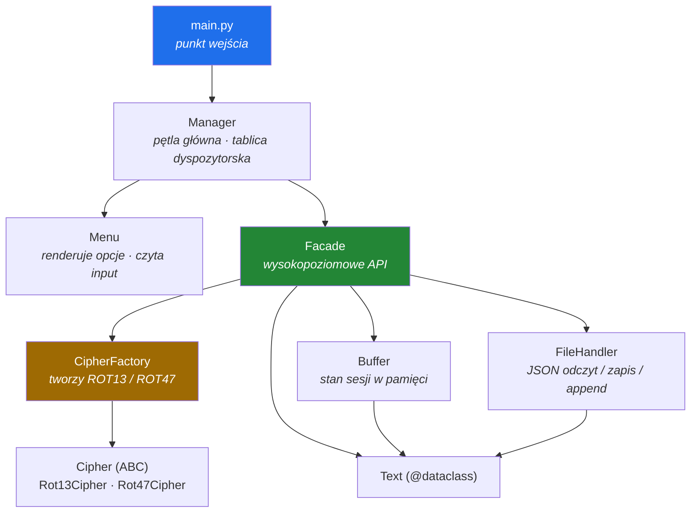

# Cipher

[](https://www.python.org/)
[](https://docs.astral.sh/ruff/)
[](https://pre-commit.com/)
[](https://docs.pytest.org/)
[](https://www.conventionalcommits.org/)

English version: [README.md](README.md)

Sterowana z menu aplikacja CLI, która szyfruje i odszyfrowuje tekst szyframi ROT13
i ROT47. Wyniki żyją w buforze w pamięci przez czas trwania sesji i można je
zapisać do plików JSON albo wczytać z nich z powrotem.

Napisałem ją, żeby przećwiczyć te elementy Pythona, które przenoszą się między
projektami: warstwowy pakiet, wzorce projektowe tam, gdzie były potrzebne,
typowane sygnatury, testy na każdej warstwie i automatyczne kontrole przed każdym
commitem. Same szyfry są najmniejszą częścią tego kodu.

Jedno zastrzeżenie: ROT13 i ROT47 nie dają żadnego bezpieczeństwa. Oba są z
założenia odwracalne i da się je złamać na kartce, więc nic tutaj nie służy do
ochrony czegokolwiek.

## Co robi

- Szyfruje i odszyfrowuje tekst ROT13 albo ROT47, wybieranym z numerowanego menu.
- Trzyma każdy wynik w buforze sesji i wypisuje go na żądanie.
- Dopisuje bufor do pliku JSON i wczytuje plik z powrotem do bufora.
- Brak pliku, brak dostępu do niego albo uszkodzony JSON zgłasza jednym typem
  wyjątku i wraca do menu.

## Architektura

Zależności wskazują w jedną stronę. Interfejs użytkownika zna `Facade` i nic poza
tym, `Facade` dyryguje podsystemami, a podsystemy zależą wyłącznie od modelu
domeny.



`Facade` dostaje swój `Buffer` i `FileHandler` przez konstruktor i właśnie dzięki
temu test może podstawić mu sobowtóry autospec i sprawdzać interakcję zamiast
zawartości dysku.

| Wzorzec | Gdzie | Co daje |
|---|---|---|
| Facade | `Facade` | Jedna powierzchnia dla CLI: `encrypt`, `decrypt`, `save`, `load`. Wymiana podsystemu nie rusza CLI. |
| Factory Method | `CipherFactory` | Dodanie kolejnego ROT-a to jedna klasa i jeden wpis w rejestrze, a żaden kod wołający nie dostaje nowego warunku. |
| Zamrożony dataclass | `Text` | `text`, `rot_type` i `status` podróżują razem jako jedna typowana wartość, a nie luźny słownik. |
| Wstrzykiwanie zależności | `Manager`, `Facade` | Współpracownicy przychodzą przez konstruktor, więc oba da się testować bez terminala i bez systemu plików. |
| Tablica dyspozytorska | `Manager` | Pętla główna wyszukuje handler w słowniku. Listę opcji rysuje `Menu`, więc nową komendę rejestruje się w dwóch miejscach. |

Pakiet od plików nazywa się `storage`, a nie `io`, żeby nie przykrywał modułu o tej
nazwie z biblioteki standardowej.

## Struktura projektu

```
Cipher/
├── main.py                     # punkt wejścia  ->  python main.py
├── README.md
├── README_PL.md
├── pyproject.toml              # konfiguracja narzędzi (Bandit)
├── .pre-commit-config.yaml     # bramki jakości
├── .gitignore
│
├── cipher/                     # pakiet aplikacji, zero zależności runtime
│   ├── facade.py               # Facade - wysokopoziomowe API (encrypt/decrypt/save/load)
│   ├── exceptions.py           # własne wyjątki (FileHandlerError)
│   │
│   ├── models/
│   │   └── text.py             # zamrożony dataclass Text + enumy RotType / Status
│   │
│   ├── ciphers/
│   │   ├── base.py             # abstrakcyjny Cipher (ABC)
│   │   ├── rot13.py            # Rot13Cipher
│   │   ├── rot47.py            # Rot47Cipher
│   │   └── factory.py          # CipherFactory
│   │
│   ├── core/
│   │   └── buffer.py           # Buffer - stan sesji w pamięci
│   │
│   ├── storage/
│   │   └── file_handler.py     # FileHandler - I/O JSON + append
│   │
│   └── cli/
│       ├── menu.py             # Menu - prezentacja i input
│       └── manager.py          # Manager - pętla główna + tablica dyspozytorska
│
└── tests/                      # zestaw pytest, odbija strukturę pakietu
    ├── test_facade.py          # 8 testów, sobowtóry create_autospec
    ├── ciphers/
    │   ├── test_rot13.py       # 12 testów, sparametryzowane przypadki brzegowe
    │   ├── test_rot47.py       #  8 testów
    │   └── test_factory.py     #  4 testy
    ├── core/test_buffer.py     #  3 testy, kopia obronna bufora
    ├── models/test_text.py     #  2 testy, kontrakt niemutowalności
    ├── storage/
    │   └── test_file_handler.py #  15 testów, izolacja przez tmp_path
    └── cli/
        ├── test_manager.py     # 17 testów, sobowtóry autospec Menu / Facade
        └── test_menu.py        # 23 testy, podmieniony builtins.input + capsys
```

## Jak uruchomić

```bash
git clone https://github.com/Robert-Stachowski/cipher.git
cd cipher

python -m venv .venv
source .venv/bin/activate        # Windows: .venv\Scripts\activate

python main.py
```

Do uruchomienia aplikacji nie trzeba niczego poza biblioteką standardową. Do pracy
nad kodem:

```bash
pip install pytest pytest-mock pre-commit

pre-commit install
pre-commit install --hook-type commit-msg
```

## Przykładowa sesja

Poniżej realny output programu: zaszyfruj słowo, zajrzyj do bufora, zapisz go na
dysk.

```text
======== CIPHER =========

1 Szyfruj
2 Odszyfruj
3 Zapisz bufor do pliku
4 Wczytaj plik do bufora
5 Pokaż bufor
0 Wyjście
> 1
Podaj tekst: Hello, recruiter!
Wybierz ROT [13 / 47]: 13
✔ Operacja udana: Uryyb, erpehvgre!  encrypted

# (menu jest przerysowywane w każdym obiegu pętli)
> 5

── Bufor (1) ─────────────────
  1. Uryyb, erpehvgre!  rot13  encrypted

> 3
Nazwa pliku: portfolio.json
✔ Operacja zapisu udana
```

Wybierz akcję, wpisz tekst, wybierz ROT. Wynik zostaje opakowany w obiekt `Text` i
trafia do bufora. Zapis dopisuje bufor do pliku o podanej nazwie i zostawia bufor
nietknięty, więc można pracować dalej; wczytanie wprowadza zawartość pliku z
powrotem do bufora.

Jeśli stanie się coś zupełnie nieprzewidzianego, sesja się kończy: komunikat
dociera do użytkownika przez menu, a traceback dopisuje się do `error.log` obok
punktu wejścia.

## Testy i jakość

```bash
pytest -q
pre-commit run --all-files
pre-commit run ruff-check --all-files
pre-commit run --files sciezka/plik.py
```

92 testy pokrywają każdą warstwę, razem z CLI. Jak są napisane:

- `create_autospec(..., instance=True)` na sobowtóry, więc zmiana nazwy metody albo
  liczby argumentów wywala test, zamiast przejść po cichu. Wcześniejszą, ręcznie
  pisaną atrapę zastąpiłem właśnie z tego powodu.
- `tmp_path` w każdym teście plikowym: prawdziwe pliki i prawdziwy round-trip JSON,
  bez zapisu poza katalogiem tymczasowym.
- `parametrize` na przypadkach brzegowych szyfrów: zawijanie na `z` i `Z`,
  nie-litery, pusty input, pełny drukowalny zakres ROT47.
- Pętla główna chodzi na `create_autospec(Menu)` i `create_autospec(Facade)`
  sterowanych przez `read_choice.side_effect`, więc routing, walidacja wejścia,
  gałąź `FileHandlerError` i wyjście przez Ctrl+C / EOF są sprawdzone bez
  terminala.
- `Menu` działa pod podmienionym `builtins.input` z `capsys`, a każda renderowana
  linia jest porównywana znak po znaku.
- Ścieżki błędów mają własne testy: zapis na katalog, zapis do nieistniejącego
  katalogu, uszkodzony JSON, obiekt JSON w miejscu listy i nieznana wartość enuma.

Ruff, isort i Bandit nie są instalowane do wirtualnego środowiska. pre-commit
ściąga każde z nich w wersji przypiętej w `.pre-commit-config.yaml` i trzyma w
osobnym środowisku, dzięki czemu każda maszyna dostaje identyczne narzędzia. Dlatego
powyższe komendy idą przez `pre-commit`, a nie wołają narzędzi wprost.

| Hook | Czego pilnuje |
|---|---|
| `ruff-check` | Linting: nieużywane importy i zmienne, niezdefiniowane nazwy, gołe `except Exception`, znaczniki czasu bez strefy. |
| `ruff-format` | Jeden kanoniczny format, żeby diffy dotyczyły logiki. |
| `isort` (profil black) | Kolejność importów: biblioteka standardowa, third-party, lokalne. |
| `bandit` | Skan bezpieczeństwa, skonfigurowany w `pyproject.toml` tak, by pomijał testy. |
| `conventional-pre-commit` | Odrzuca commit, którego treść nie jest poprawnym Conventional Commitem. |
| pre-commit-hooks | Białe znaki na końcu linii, brak newline'a na końcu pliku, zepsute YAML/TOML/JSON, za duże pliki, znaczniki konfliktu, zapomniany `breakpoint()`, nazewnictwo plików testowych. |

W pierwotnym planie był `flake8`. Zamieniłem go na Ruffa, bo obsługuje linting,
formatowanie i kolejność importów, na które inaczej trzeba czterech albo pięciu
osobnych narzędzi, i jest na tyle szybki, że siedzi na każdym commicie
niezauważony. Kosztem jest to, że `flake8` wciąż ma niszowe pluginy, których Ruff
nie przeportował.

## Konwencje

- Styl PEP 8, wymuszany przez `ruff format` i `ruff check`.
- Typowanie każdej sygnatury, łącznie z `ClassVar` na rejestrach klasowych w
  `CipherFactory` i `Manager`. Docstringi tam, gdzie sygnatura nie mówi wszystkiego.
- Liniowa historia na `main`: drobne commity zamiast długo żyjących gałęzi.
- Przelot formatujący i zmiana zachowania nigdy nie dzielą jednego commita.
- Conventional Commits ze scope'em tam, gdzie ma sens, walidowane hookiem
  `commit-msg`, np. `feat(filehandler): add new way of handling files`. Używane
  typy: `feat`, `fix`, `build`, `chore`, `ci`, `docs`, `style`, `refactor`, `perf`,
  `test`.

## Stack

Runtime: Python 3.11+, wyłącznie biblioteka standardowa — `dataclasses`, `enum`
(`StrEnum`), `abc`, `json`, `typing`.

Deweloperskie: pytest, pytest-mock, Ruff, isort, Bandit, pre-commit.

## Plan rozwoju

| | Status |
|---|---|
| Aplikacja: architektura, wzorce, CLI | Gotowe |
| Testy: szyfry, fabryka, bufor, model, storage, fasada | Gotowe, 52 testy |
| Testy: `Manager` i `Menu` | Gotowe, 40 testów |
| Bramki jakości: Ruff, isort, Bandit, pre-commit, walidacja commit-msg | Gotowe |
| Statyczna kontrola typów `mypy` | Planowane |
| CI na GitHub Actions | Planowane |

## Autor

Robert Stachowski. Projekt portfolio: czysta architektura, wzorce projektowe i
zdyscyplinowany Python.
